# DiNA
DiNA is a professional networking application like LinkedIn

## Authors

- George Liontos - sdi1600094
- Themis Varveris - sdi1600015

## Tools Used

- Python3 (Flask)
- PostgreSQL
- PyCharm
- TypeScript (Angular)
- Material UI
- Docker
- Various NPM dependencies (package.json)

## Database Installation
Our database is in docker (we would dockerize the rest of the components as well be we didn't have the time to).

In order to install and create the database, you just need to run:
```bash
docker-compose -f dina_docker.yml up -d
```

NOTE: This assumes that you have docker and docker-compose installed and you can run docker without sudo

## Back End Installation
```bash
cd back-end
source venv/bin/activate
pip install -r requirements.txt
flask init-db # initializes database schema and static data
```

## Front End Installation
```bash
cd front-end/dina
npm install
```

## How to run Back End

```bash
cd back-end/src
source ../venv/bin/activate
python app.py
```

## How to run Front End

```bash
cd front-end/dina
npm start
```

Then browse to https://localhost:4200/welcome


## Sign Up
This is the sign-up page. You can make an account just filling the fields are shown below. The fields with the asterisk are mandatory otherwise the user can't continue with the registration.
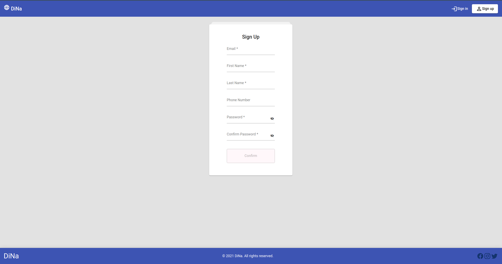

## Sign In
This is the sing-in page. After the registration the user can log in with the email and the password.
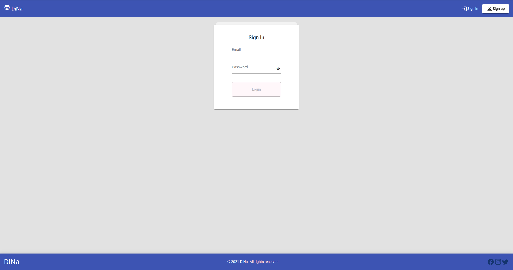

## Admin
This is the admin page. Only admins, that are already in the database, can browse to this page. Admins can see every information regarding the users. They can also extract these data by simply export them in the form of JSON or XML.

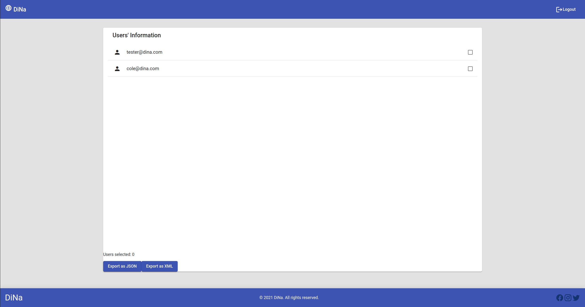

## Home - Timeline

This is the home page. This page is shows up when a user is logging in. In this page a user can see its uploaded articles and articles that have been uploaded by its network. A user can leave a comment on the article or press the like button to show its interest. The user can also see articles that are recommended by the DiNA application. We use Matrix Factorization algorithm in order to produce the recommended articles.

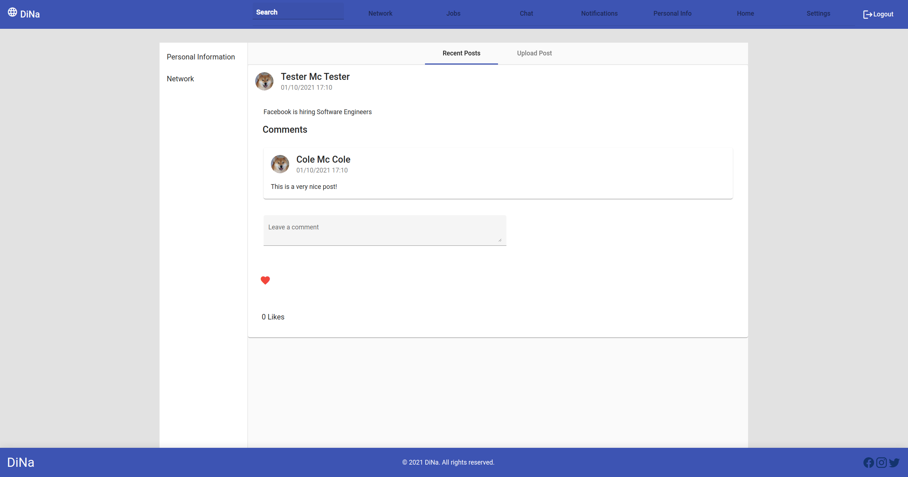

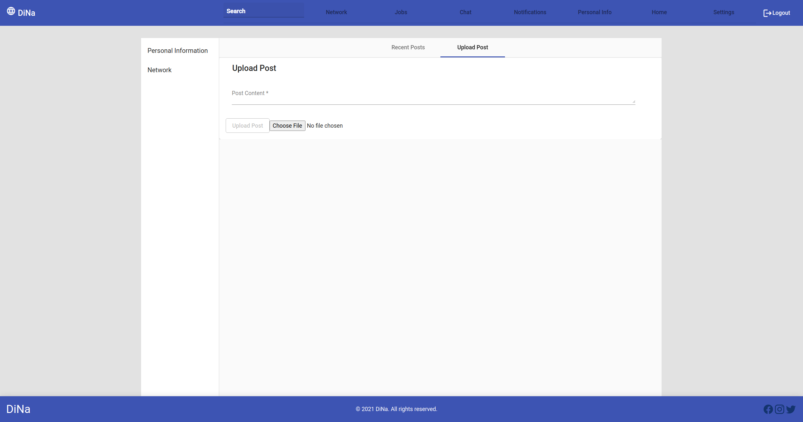

## Profile Information

This is the profile page. A user can modify his information about his personal interests/skills, working experience and education. He can also choose which of these information wants to be public or private. Private information are only visible by his network. The user can also change his avatar.

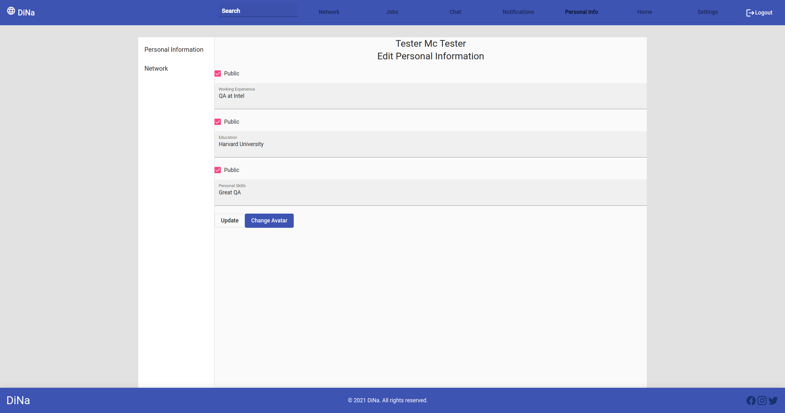


## Notifications

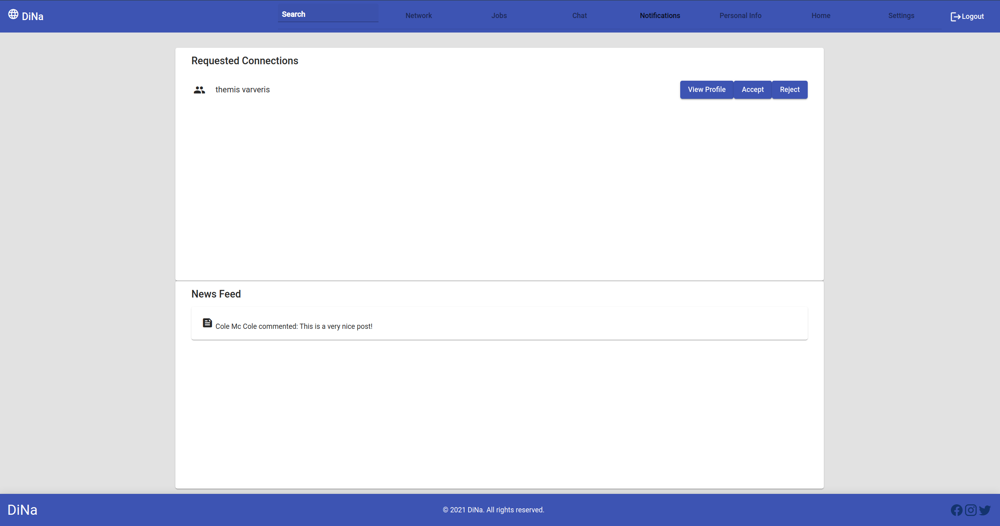


## Job Posts

The job posts page consists of four tabs each one having a different category of job bosts. Each tab loads its content lazily for better performance.

First, we have the available job posts tab:

In this tab we will find a list of available job posts recommended to us (the connected user) based on the job posts that have been created by people in our network as well as job posts from people outside of our network based on some metrics (e.g popularity).

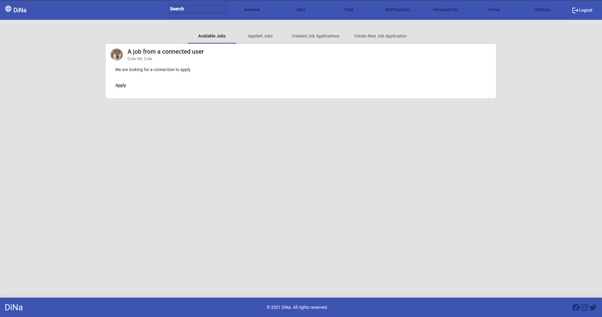

Secondly, the next tab shows us the job posts that we have already applied to:

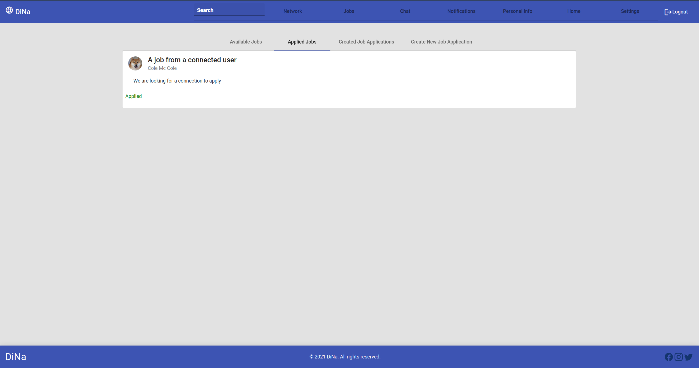

Thirdly, the next tab shows us the job posts that we have created. For each job post that we have created, we can also see a list of the applicants to this job post by clicking "Show Applicants":

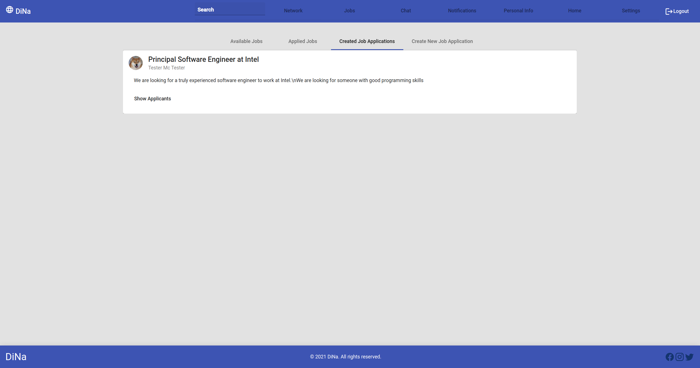

Finally, we have a page where we can create a new job post for the world to see:

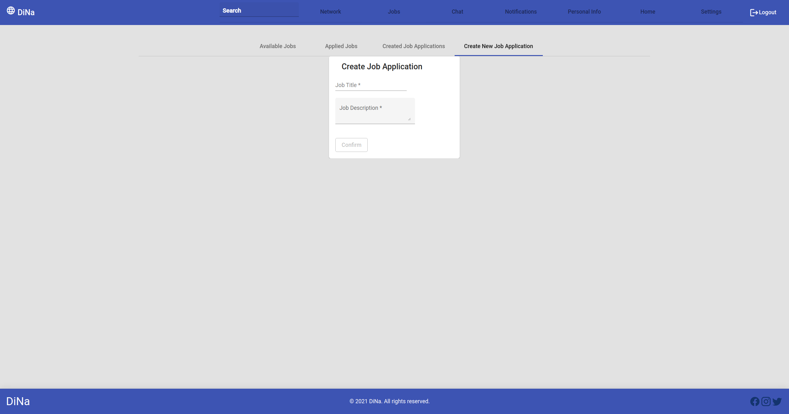

## Network

This is the network page. In this page a user can see its network, the users that his connected to. For each connected user can either choose to view the user's profile or chat with him. The network page is shown as a grid of connencted users.
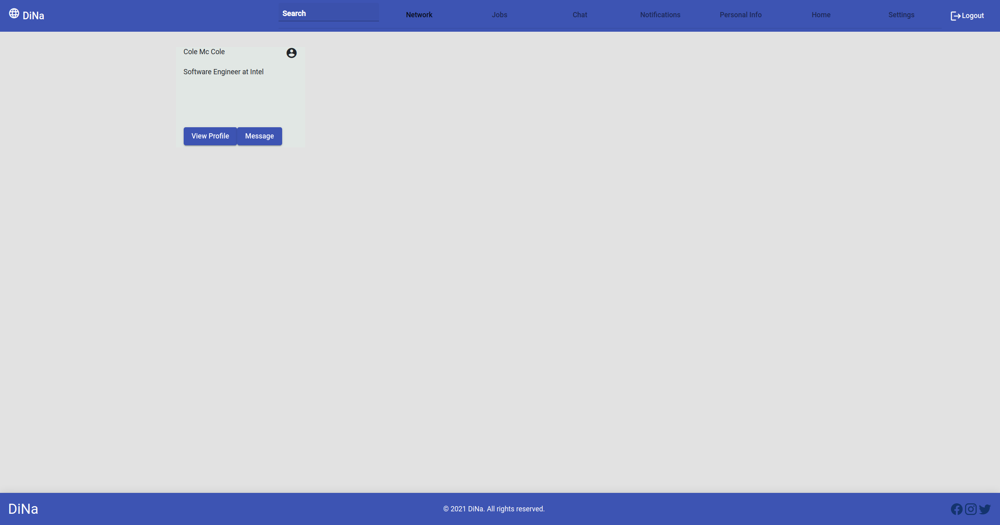

Each time a user can search for another user by simply using the search bar in the navbar menu. The results of the searching are shown as a list of users. If there is no user with such name the application shows a corresponding message.

## Chat

The chat is a page where you can see the users that you last contacted with. The first user of the list on the left is the user you last contacted with (or they have contacted you). On the center of the page you will find the chat which contains the messages of the selected user in chronological order that they were sent.

The implementation of the chat was achieved using a traditional REST API for getting the users as well as each user's messages but we also used websockets in order to have real time messaging between the users. However, the sockets use the REST rules for their resource endpoints.


## Settings

This is the settings page. In this page the user can either choose to change his email or his password. Each time he chooses the right box and then he completes the necessary information.
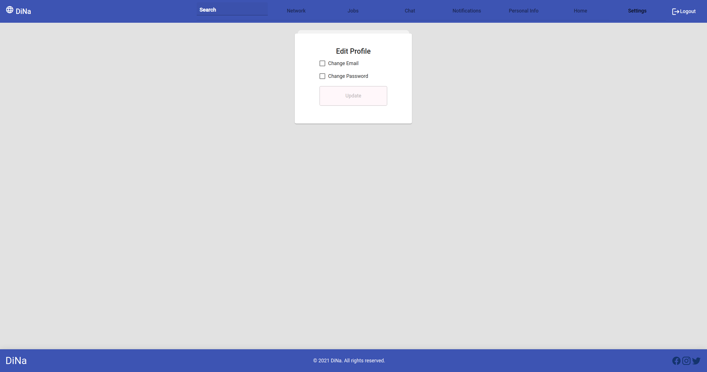


