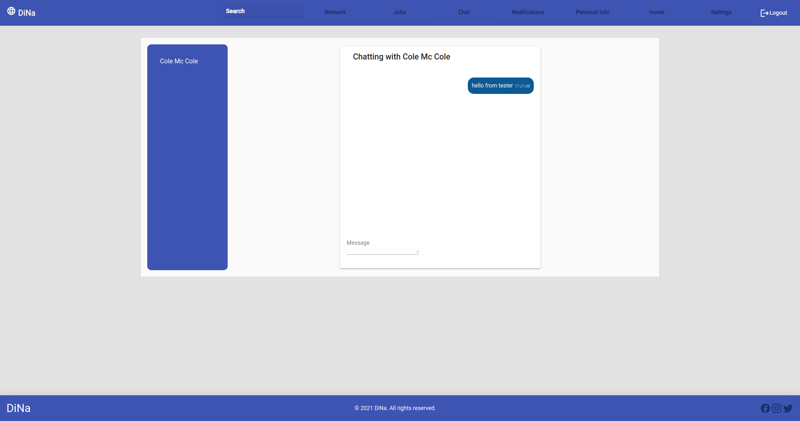

# DiNA
DiNA is a professional networking application like LinkedIn

## Authors

- George Liontos - sdi1600094
- Themis Varveris - sdi1600015

## Tools Used

- Python3 (Flask)
- PostgreSQL
- PyCharm
- TypeScript (Angular)
- Material UI
- Docker
- Various NPM dependencies (package.json)

## Start Docker

```
```

## How to run back-end

```
cd /back-end/src
source ../venv/bin/activate
flask init-db # this is needed only once to initialize schema and insert static data
python3 app.py
```

## How to run front-end

```
cd /front-end/dina
npm install
npm start

Then browse to https://localhost:4200/welcome
```


## Sign Up
This is the sign-up page. You can make an account just filling the fields are shown below. The fields with the asterisk are mandatory otherwise the user can't continue with the registration.


## Sign In
This is the sing-in page. After the registration the user can log in with the email and the password.


## Admin
This is the admin page. Only admins, that are already in the database, can browse to this page. Admins can see every information regarding the users. They can also extract these data by simply export them in the form of JSON or XML.


## Home - Timeline

This is the home page. This page is shows up when a user is logging in. In this page a user can see its uploaded articles and articles that have been uploaded by its network. A user can leave a comment on the article or press the like button to show its interest. The user can also see articles that are recommended by the DiNA application. We use Matrix Factorization algorithm in order to produce the recommended articles.


## Profile Information

This is the profile page. A user can modify his information about his personal interests/skills, working experience and education. He can also choose which of these information wants to be public or private. Private information are only visible by his network. The user can also change his avatar.


## Notifications


## Job Posts


## Network


## Chat




## Settings


